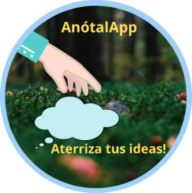
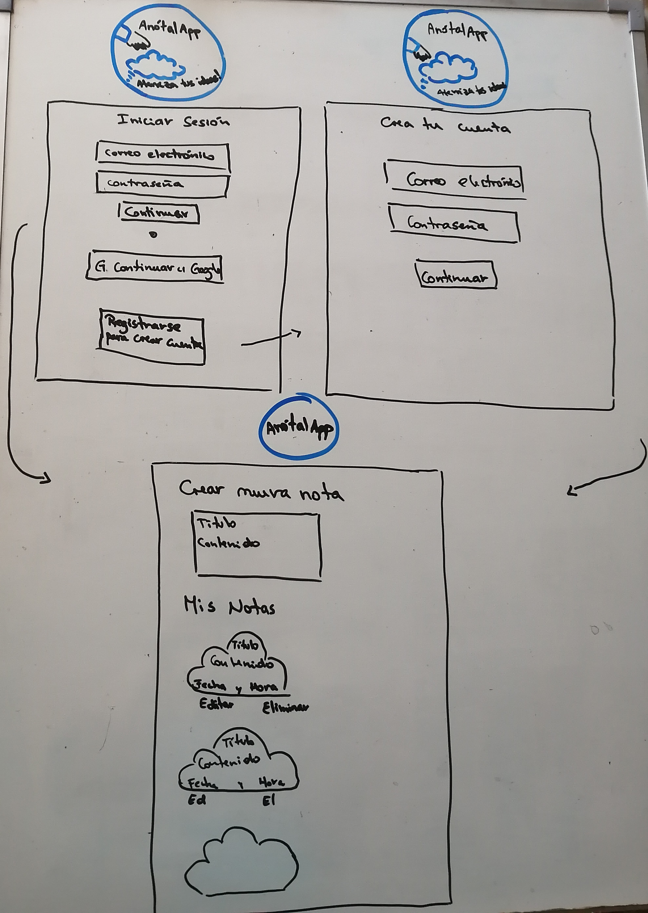
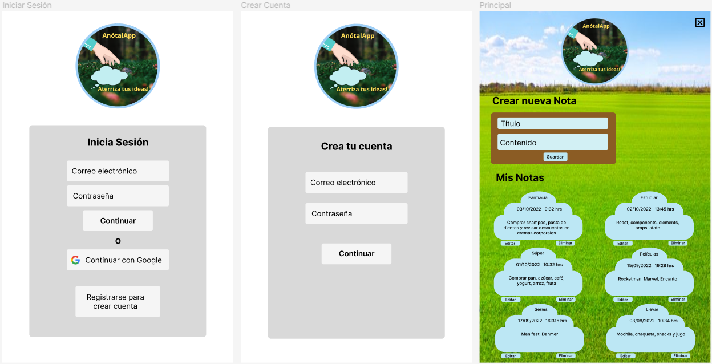
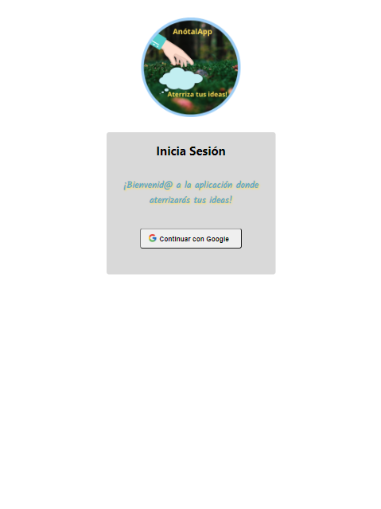
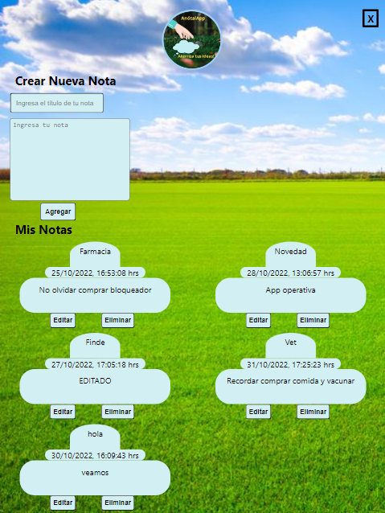

# AnótalApp

## Índice

* [1. Resumen del proyecto](#1-resumen-del-proyecto)
* [2. Historias de usuario](#2-historias-de-usuario)
* [3. Prototipo de baja](#3-prototipo-de-baja)
* [4. Prototipo de alta](#4-prototipo-de-alta)
* [5. Resultado final](#5-resultado-final)

## 1. Resumen del proyecto

AnótalApp es una aplicación para tomar notas 📝, nos permite crear, editar, eliminar y consultarlas en cualquier momento.
Muchas veces necesitamos tomar notas de direcciones, teléfonos, URLs o cualquier actividad que no queramos olvidar 💡 y qué mejor que guardarlas en AnótalApp ☁️, donde podrás consultarlas cuando quieras y donde quieras, sin perderlas 🙌🏼.

Para utilizarla, ingresa por [acá](https://anotalapp.web.app/) y accede con tu cuenta de Google.

Este proyecto es una Web App responsive y utilicé React y Firebase. Además la aplicación es una SPA.

## 2. Historias de usuario

- 1. Yo como usuaria debo poder crear una cuenta y autenticarme usando login de Google para acceder a mis notas.
- 2. Yo como usuaria quiero tomar nota para no depender de mi mala memoria y tener presente en todo momento los apuntes o cosas importantes que antes escribía en papel.
- 3. Yo como usuaria quiero leer mis notas para recordar lo que escribí antes.
- 4. Yo como usuaria quiero editar notas para poder modificar lo que escribí antes.
- 5. Yo como usuaria quiero borrar una nota para no volver a verla.

## 3. Prototipo de baja

## 4. Prototipo de alta

## 5. Resultado final

